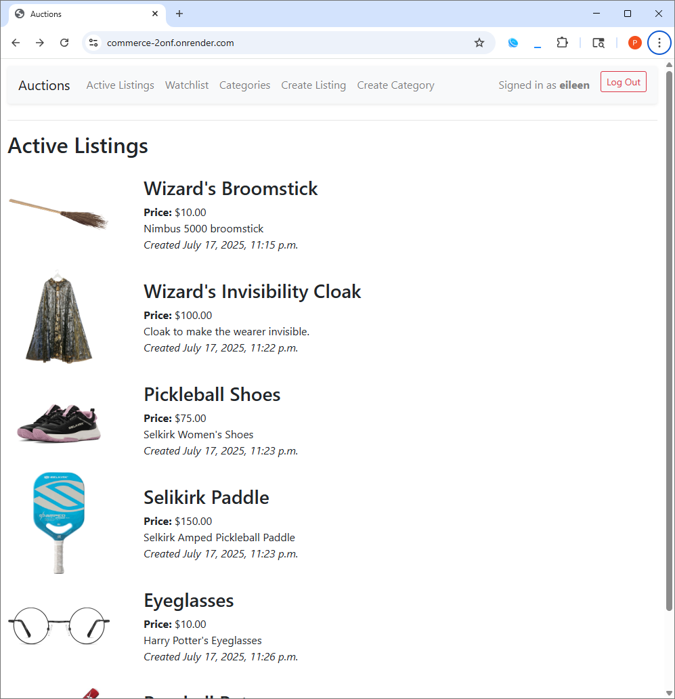
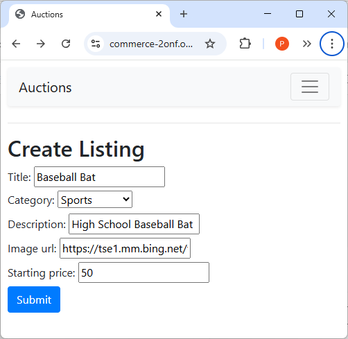
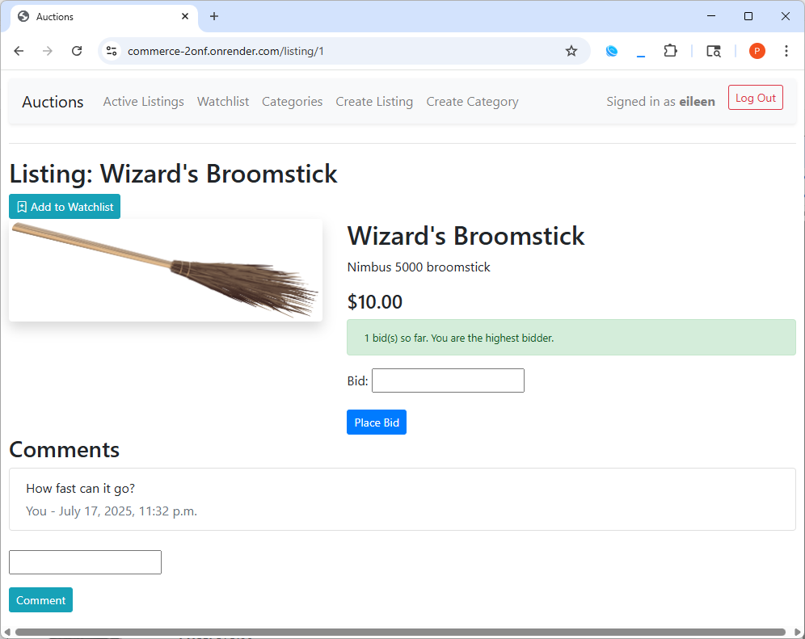

# 🛍️ Commerce

**Built for [CS50’s Web Programming with Python and JavaScript (CS50W)](https://cs50.harvard.edu/web/).**  
An eBay-style auction platform where users can list items, place bids, comment on listings, and manage watchlists.

---

## 🚀 Features

- User authentication (register, login, logout)
- Create auction listings with title, description, starting bid, category, and image
- Place bids and view current highest bidder
- Comment on listings
- Add/remove items from a personal watchlist
- Close listings and declare winner
- Browse active listings by category
- Responsive design using Bootstrap

---

## 📸 Screenshots

<p float="left">
  
  
  
</p>

---

## ▶️ Live Demo

- 🌐 Live site: [https://commerce-2onf.onrender.com](https://commerce-2onf.onrender.com)
- 📺 Video demo: [Watch on YouTube](https://youtu.be/4660HxMfK10)

---

## 🛠️ Tech Stack

- **Backend:** Django (Python)
- **Frontend:** HTML, CSS, Bootstrap
- **Database:** SQLite
- **Auth:** Django’s built-in authentication system

---

## 📦 Setup Instructions

1. **Clone the repository:**

   ```bash
   git clone https://github.com/phillip-l-rogers/commerce.git
   cd commerce
   ```
   
2. **Create and activate a virtual environment:**

   ```bash
   python -m venv venv
   source venv/bin/activate    # On Windows: venv\Scripts\activate
   ```

3. **Install dependencies:**

   ```bash
   pip install -r requirements.txt
   ```

4. **Apply migrations:**

   ```bash
   python manage.py migrate
   ```

5. **Run the development server:**

   ```bash
   python manage.py runserver
   ```
   
6. **Visit:**

   `http://127.0.0.1:8000/` in your browser.
   
---

## 🧪 Testing Tips

- Register multiple users to simulate bidding interactions
- Test tie-breakers by placing bids with equal value
- Add, remove, and view items in your watchlist
- Use the Django admin panel to verify database changes

---

## 📁 Project Structure

```bash
commerce/
├── auctions/          # Main app
│   ├── models.py
│   ├── views.py
│   ├── urls.py
│   └── templates/
├── manage.py
└── requirements.txt
```

---

## 📚 Acknowledgments

- This project was completed as part of [CS50’s Web Programming with Python and JavaScript (CS50W)](https://cs50.harvard.edu/web/)
- Built using the Django web framework and Bootstrap

---

## 📜 License

- This project was completed as part of Harvard CS50W. Educational use only.
